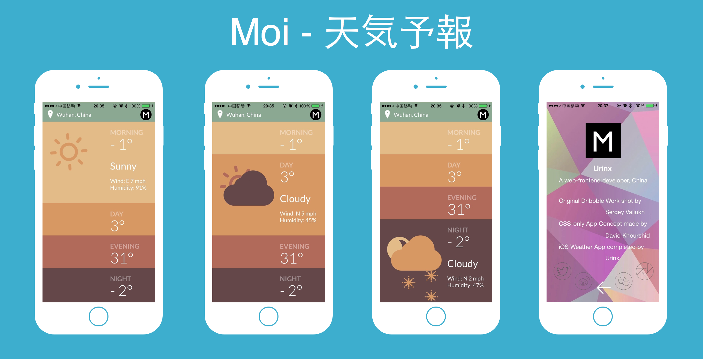

# Moi
天気予報 - iOS Weather App [(http://urinx.github.io/app/moi/)

一款天气预报应用。身历其境的天气体验，在提供精确天气预报的同时，配以精美的风景照，更是一种浸入式的体验，使查看和共享天气情况既好玩又有趣。

## Install

This app is NOT available on App Store, but you can get it from [pre.im](http://pre.im/40fb).

Also, You can download the source code, rebuild it in Xcode7 and then you can run and test it on your iPhone device.

## Requires

Only compatible with iPhone 5 and 5s, also requires iOS 8.3 and up!

## Thanks

Original Dribbble Work shot by [Sergey Valiukh](https://dribbble.com/shots/1824088-GIF-for-the-Weather-App)

CSS-only Weather App Concept made by [David Khourshid](http://codepen.io/davidkpiano/pen/ByNPQw)

iOS Weather App completed by [Urinx](http://urinx.github.io/)